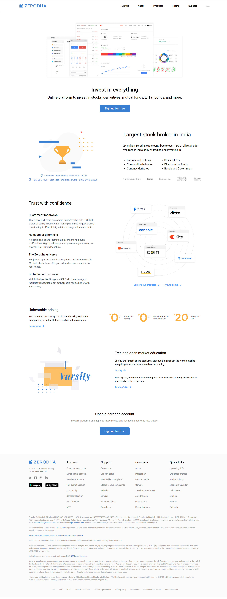
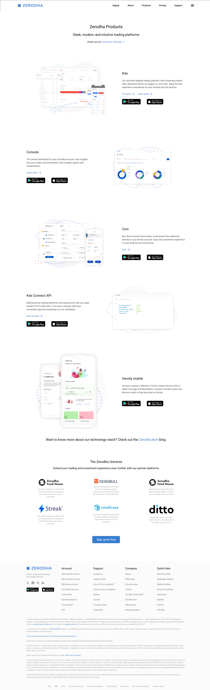
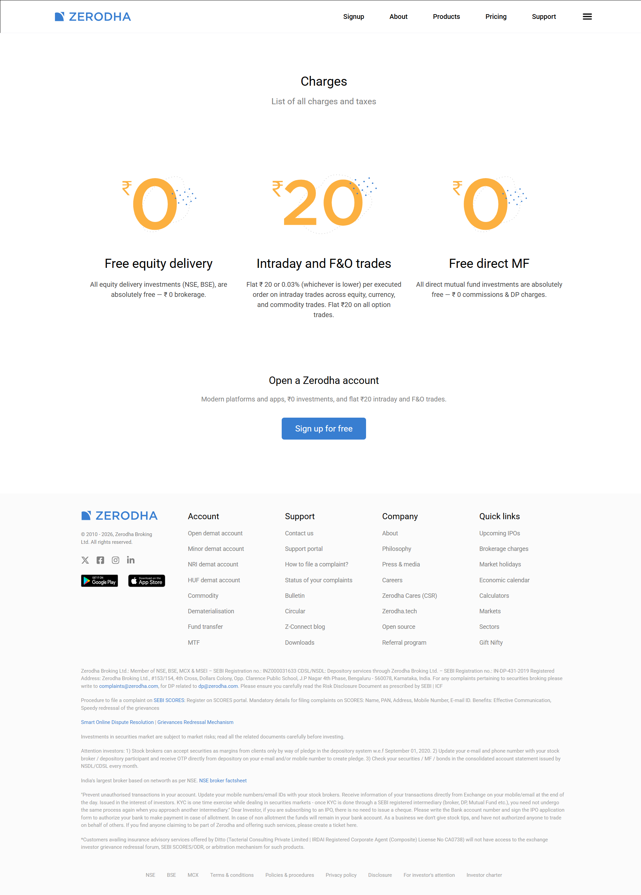
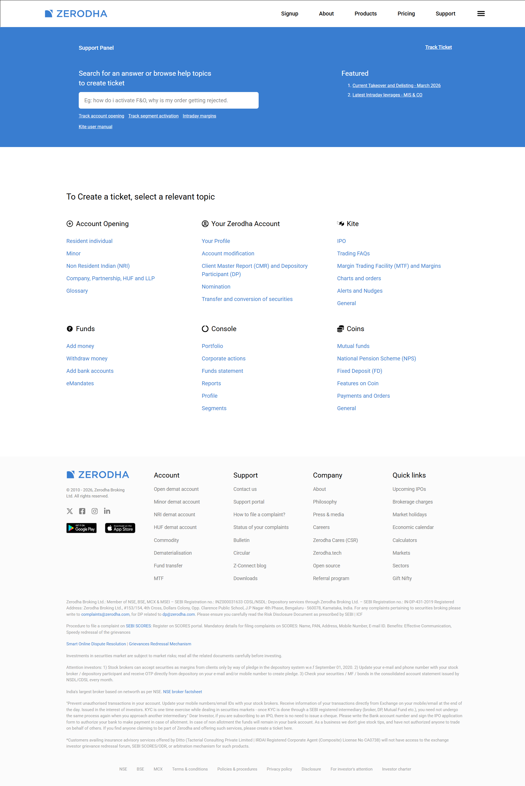
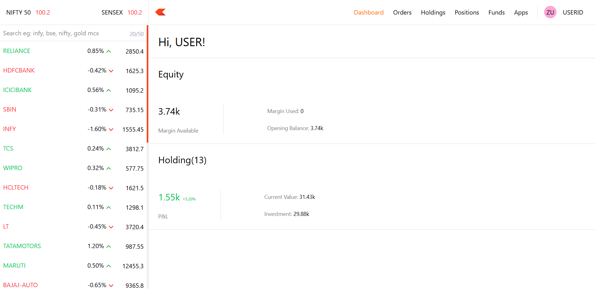
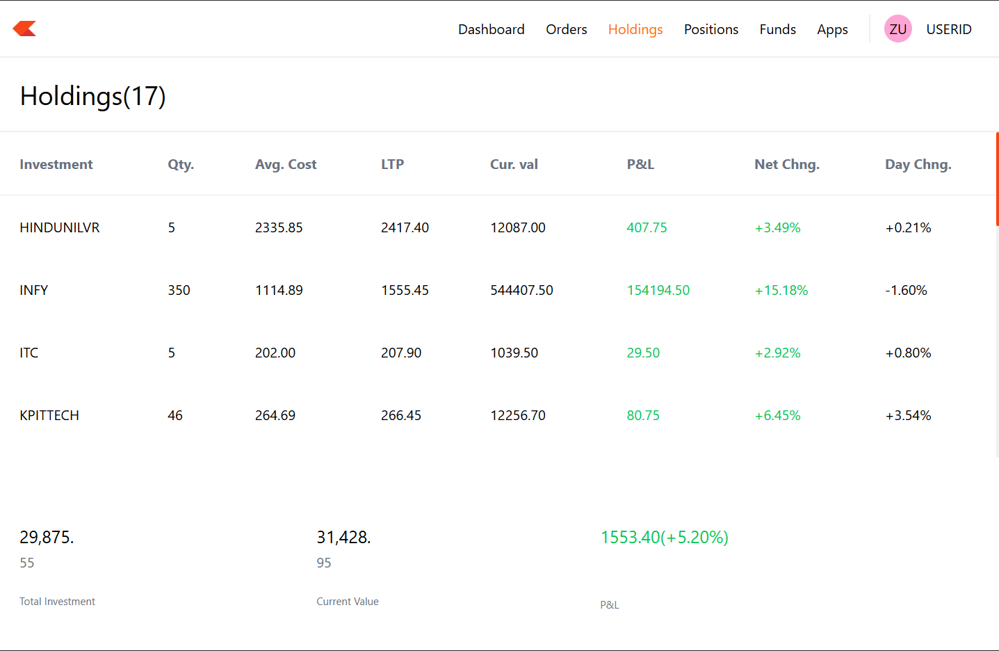
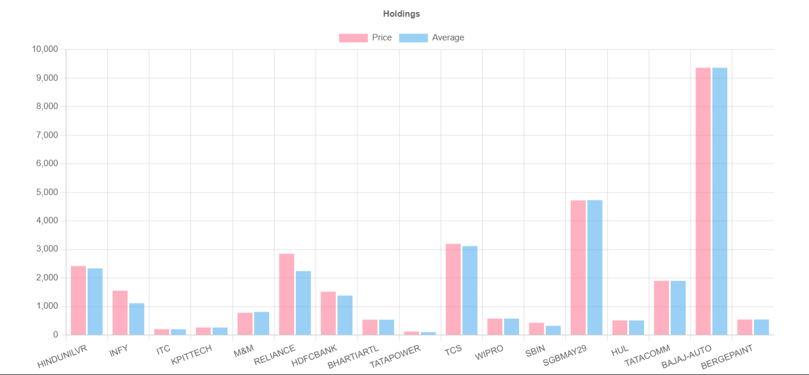
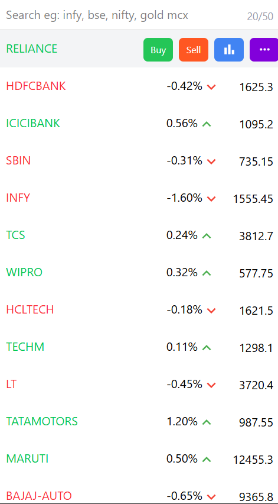
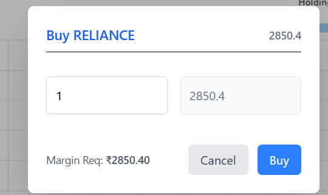

# 📈 Trade Nova


**Trade Nova** is a comprehensive, full-stack web application that simulates a modern stock trading brokerage platform. Built with the MERN stack (MongoDB, Express, React, Node.js), it features a consumer-facing landing page, a robust trading dashboard for portfolio management, and a secure backend for order execution and data storage.

## ✨ Features

- **Interactive Dashboard:** View comprehensive account summaries, funds, and equity margins.
- **Portfolio Management:** Track real-time holdings, active positions, and overall P&L.
- **Order Execution:** Intuitive buy/sell windows for seamless trade simulation.
- **Market Watchlist:** Monitor favorite stocks and assets.
- **Data Visualization:** Integrated Doughnut and Vertical charts for detailed portfolio and market analysis.
- **Modern Landing Page:** A fully responsive marketing site detailing products, pricing, and support, inspired by top-tier brokerages.

---

## 📸 Screenshots

### 1. Consumer Website (Frontend)

**Home / Landing Page**

> The main consumer-facing website showcasing platform features.
> 

**Products Page**

> Exploring the trading universe, platforms, and investment products.
> 

**Pricing Page**

> Transparent fee structures for direct mutual funds, equity delivery, and intraday trading.
> 

**About Us Page**

> Showcasing the company's journey, milestones, and core team.
> 

**Support Portal**

> Help center for users to resolve issues, raise tickets, and read FAQs.
> 

### 2. Trading Application (Dashboard)

**Trading Dashboard & Watchlist**

> The central hub for users to view their market overview, funds, and watchlists.
> 

**Holdings & Analytics**

> Detailed view of user holdings with interactive charting (Doughnut & Vertical Charts).
> 
> 

**Buy/Sell Order Window**

> The interface for executing market and limit orders with real-time margin calculation.
> 
> 

---

## 🛠️ Tech Stack

**Frontend (Landing Page & Dashboard):**

- React.js
- Vite (Build Tool)
- React Router (Navigation)
- Axios (API Requests)
- CSS / UI Component Libraries (for styling and charts)

**Backend:**

- Node.js
- Express.js
- Mongoose (ODM)

**Database:**

- MongoDB

---

## 📂 Project Structure

```text
TRADENOVA/
├── backend/                         # Node.js & Express API
│   ├── config/
│   │   └── mongooseConfig.js       # MongoDB connection setup
│   │
│   ├── models/                     # Mongoose Models
│   │   ├── HoldingModel.js
│   │   ├── OrdersModel.js
│   │   └── PositionsModel.js
│   │
│   ├── schemas/                    # Mongoose Schemas
│   │   ├── HoldingSchema.js
│   │   ├── OrdersSchema.js
│   │   └── PositionsSchema.js
│   │
│   ├── node_modules/
│   ├── .env
│   ├── .gitignore
│   ├── index.js                    # Entry point of backend
│   ├── package.json
│   └── pnpm-lock.yaml
│
├── dashboard/                      # React Dashboard (Trading App)
│   ├── public/
│   │   ├── favicon.svg
│   │   └── icons.svg
│   │
│   ├── src/
│   │   ├── assets/                # Images / static files
│   │   ├── components/            # UI components
│   │   ├── data/                  # Static / mock data
│   │   ├── pages/                 # App pages
│   │   ├── utils/                 # Helper functions
│   │   ├── App.css
│   │   ├── App.jsx
│   │   ├── index.css
│   │   └── main.jsx               # React entry point
│   │
│   ├── .gitignore
│   ├── eslint.config.js
│   ├── index.html
│   ├── package.json
│   ├── pnpm-lock.yaml
│   ├── README.md
│   └── vite.config.js
│
├── frontend/                      # Landing Page (Marketing Site)
│   ├── public/
│   ├── src/
│   │   ├── assets/                # Images / assets
│   │   ├── components/            # UI sections
│   │   ├── pages/                 # Pages (Home, About, etc.)
│   │   ├── App.css
│   │   ├── App.jsx
│   │   ├── index.css
│   │   └── main.jsx
│   │
│   ├── .gitignore
│   ├── eslint.config.js
│   ├── index.html
│   ├── package.json
│   ├── pnpm-lock.yaml
│   ├── README.md
│   └── vite.config.js
```

## 🚀 Installation & Setup

To run this project locally, you need to start **backend**, **dashboard**, and **frontend** separately.

> ⚠️ Make sure you have **Node.js** and **MongoDB** installed.

---

### 📥 1. Clone the Repository

```bash
git clone https://github.com/aditya-singhofficial/trade-nova.git
cd trade-nova
```

---

### ⚙️ 2. Setup the Backend

Open a new terminal:

```bash
cd backend
pnpm install
```

Create a `.env` file inside `backend/` and add:

```env
MONGODB_URI=your_connection_string
```

Then run:

```bash
pnpm start
```

✅ Backend will run on:
👉 http://localhost:3000 (or your configured port)

---

### 📊 3. Setup the Trading Dashboard

Open another terminal:

```bash
cd dashboard
pnpm install
pnpm dev
```

✅ Dashboard will run on:
👉 http://localhost:5173

---

### 🌐 4. Setup the Landing Page (Frontend)

Open another terminal:

```bash
cd frontend
pnpm install
pnpm dev
```

✅ Frontend will run on:
👉 http://localhost:5174 (or another available port)


---

## 🗄️ Database Models Overview

The core trading logic is built around these collections:

- 📈 **Holdings**
  Stores long-term stock ownership data (quantity, average price)

- ⚡ **Positions**
  Tracks short-term / intraday trades

- 🧾 **Orders**
  Maintains history of all buy/sell transactions

---

## 🤝 Contributing

Contributions are welcome! 🎉

1. Fork the project
2. Create your feature branch:

   ```bash
   git checkout -b feature/AmazingFeature
   ```

3. Commit your changes:

   ```bash
   git commit -m "Add AmazingFeature"
   ```

4. Push to GitHub:

   ```bash
   git push origin feature/AmazingFeature
   ```

5. Open a Pull Request 🚀

---

## ⭐ Support

If you like this project, give it a ⭐ on GitHub!
